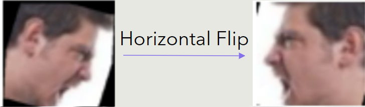
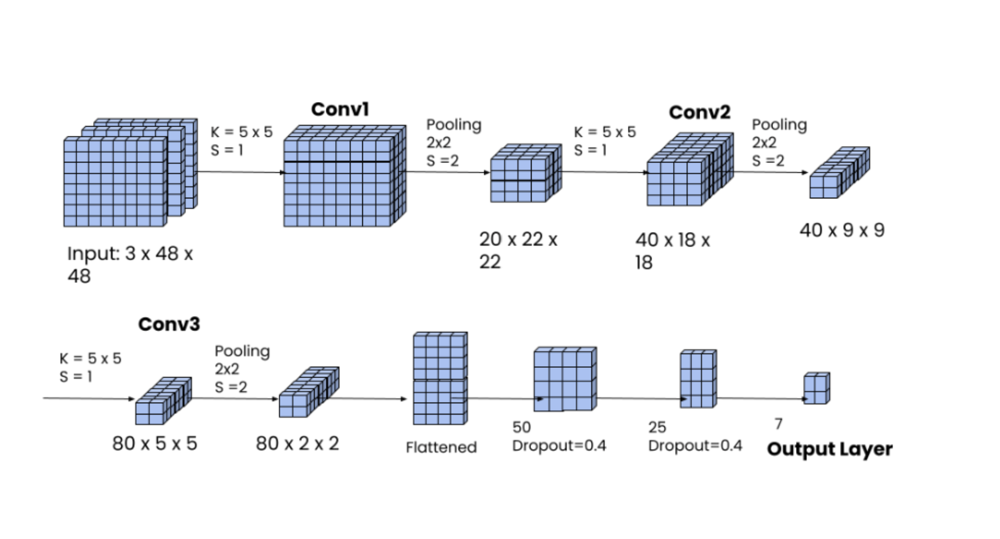
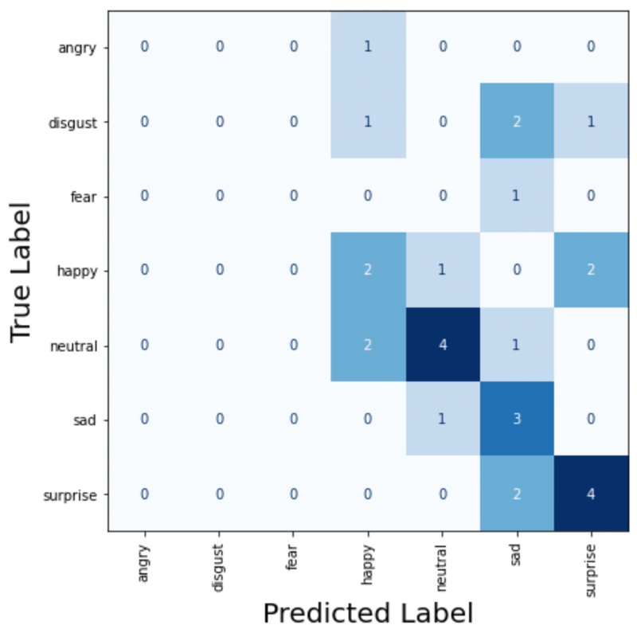
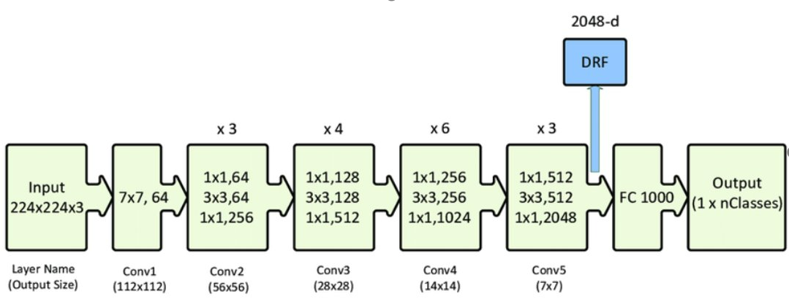
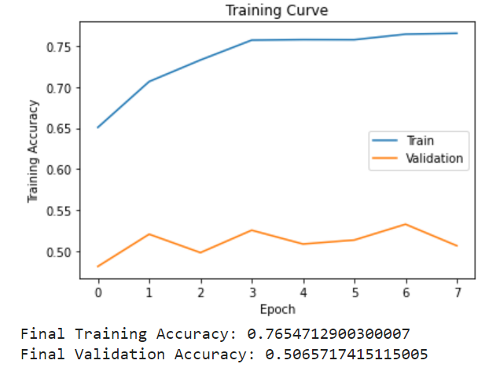
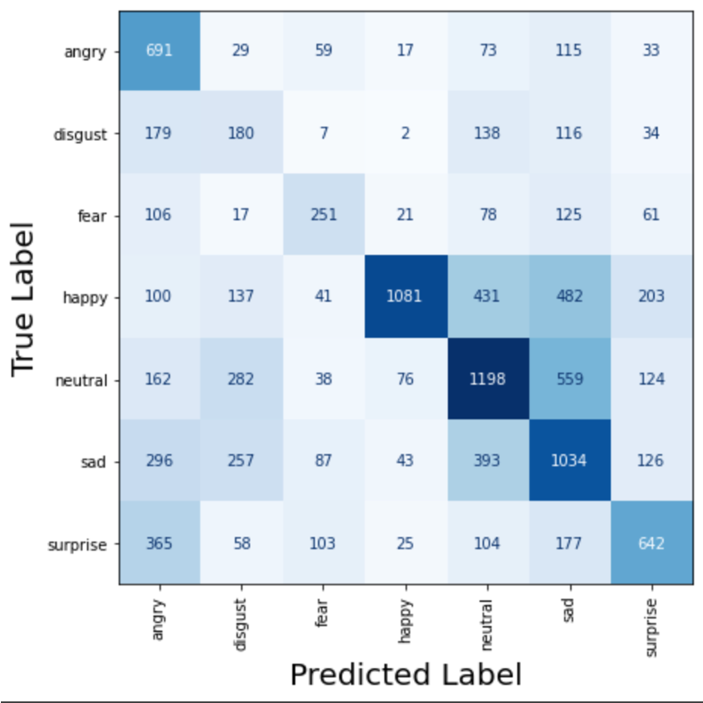

# Facial Expression Recognition
## Project Description
Our team created a facial expression recognition program using machine learning (ML) that takes face images as input and outputs the expression of that face, such as angry, disgust, fear, happy, neutral, sad and suprise. We applied advanced machine learning techniques such as data augmentation, transfer learning and statistical analysis to achieve a final validation accuracy of 53.3% and testing accuracy of 53.8%. This is our final project for APS 360 (Applied Fundamentals of Deep Learning) during 2022 summer semester.

## Team Member
- Mark Qi
- Richard Zhao
- Yulang Luo
- Linda Wang

## Data Augmentation
- We applied several data augmentation techniques to balance the data and pervent the model from overfitting (Memorizing The Images Rather Than Learning Image Features For Classification).
- Some techniques used are random horizontal flip, random affine, gaussian blur and more.

   

- We were able to amass a total of 51,332 images of facial expressions.

## Model Architecture
### Baseline Model
#### LargeNet
- LargeNet is a convolutional neural network consisting of three convolution layers, three max-pooling layers and three linear layers, each with a 0.4 dropout except for the output layer.
- We trained this model using cross-entropy as the loss function and SGD with momentum to optimize weights.
- The final validation accuracy for this baseline model is 30.0%

   

#### Human
- Each team member identified 28 randomly selected images from our processed dataset, the average accuracy of our team is exactly 50%.

   

### Final Model
- Convolutional neural network is best suited for image classification task becuase of its feature learning capability and it can reduce high dimensionality without losing critical information necessary for classification.
- ResNet 50 is a pre-trained convolutional neural network that is trained on dataset from ImageNet, and it has won the LSVRC2012 classification contest.
- We used all 50 layers of ResNet50, including convolutional layers, batch-normalization layers, max-pooling and average-pooling layers.
- We modified the final output layer from 1000 classes to 7 classes to fit the context of our project.
- The model was trained with categorical cross-entropy as the loss function, SGD with momentum and weight decay as the optimizer.
- The model achieved a final validation accuracy of 53.3% and testing accuracy of 53.8%.

   

## Training/Hyperparameters/Testing
- The augmented data were split at a ratio of 70% training data and 15% each for validation and testing data.
- Final hyperparameters are batch size (64), learning rate (0.01), momentum (0.9) and weight decay (0.002).
- All testing data were never seen during the training and validation process. The testing data were fed to the trained model and the testing accuracy was 53.8%
- We also organized new dataset with 28 images of team member's facial expression and the classification accuracy were 67.8%

   

## Statistical Analysis
- We made several confusion matrix to identify the weakness and strength of our model based on its accuracy on certain classes.
- Training and validation accuracy graph clearly demonstrated if the model is overfitting or underfitting.

   

## Conclusion
It were a great experience working with these amazing team members and the fianl result were satisfactory nonetheless. Good Job!
